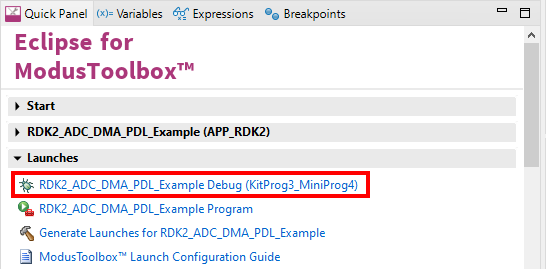

# RDK2 Arduino ADC DMA PDL Example

Rutronik Development Kit Programmable System-on-Chip CY8C6245AZI-S3D72 "Arduino ADC DMA PDL " Example. 

This example demonstrates how to use PDL library to measure all the ADC channels on the Arduino ADC header. 

 

## Requirements

- [ModusToolbox® software](https://www.infineon.com/cms/en/design-support/tools/sdk/modustoolbox-software/) v3.0

### Using the code example with a ModusToolbox IDE:

1. Import the project: **File** > **Import...** > **General** > **Existing Projects into Workspace** > **Next**.
2. Select the directory where **"RDK2_Arduino_ADC_DMA_PDL"** resides and click  **Finish**.
3. Select and build the project **Project ** > **Build Project**.

### Operation

The firmware example uses KitProg3 Debug UART for the debug output. The ADC peripheral measures all the Arduino ADC channels and transfers converted data to the allocated memory in RAM using DMA. ADC peripheral is triggered by the hardware timer at fixed sample rate and runs continuously without CPU intervention. Only DMA interrupt needs to be serviced each time the DMA completes data transfer. Most of the configuration is done using the "Device Configurator". Further initialization is done in a function where sampling timer, ADC and DMA are also started:

```
cy_rslt_t app_hw_init(void)
```

The data is read from the data array and converted to millivolts every second. The result can be seen in a terminal:


### Debugging

If you successfully have imported the example, the debug configurations are already prepared to use with a the KitProg3, MiniProg4, or J-link. Open the ModusToolbox perspective and find the Quick Panel. Click on the desired debug launch configuration and wait for the programming to complete and debugging process to start.



## Legal Disclaimer

The evaluation board including the software is for testing purposes only and, because it has limited functions and limited resilience, is not suitable for permanent use under real conditions. If the evaluation board is nevertheless used under real conditions, this is done at one’s responsibility; any liability of Rutronik is insofar excluded. 


